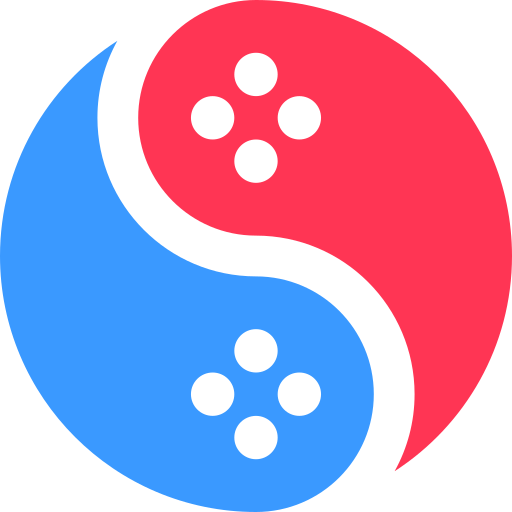

# suyu

<h1 align="center">
  <br>
  
  <br>
  <b>suyu</b>
  <br>
</h1>

<h4 align="center">
Nintendo Switch emulator and native recompiler — based on <a href="https://git.eden-emu.dev/eden-emu/eden">Eden</a>, which itself descends from yuzu.
</h4>

<p align="center">
  <a href="#status">Status</a> |
  <a href="#building">Building</a> |
  <a href="#license">License</a>
</p>

---

> **This is the final public release of suyu — v0.04. This repository is a public archive.**
>
> No further development or downloads are planned. The codebase is preserved here under GPL-3.0 for historical reference and community use.

## About

suyu is a Nintendo Switch emulator and AArch64 native recompiler written in C++. It can run decrypted Switch titles using either:

- **HLE/emulation mode** — full hardware-level emulation via the suyu core (GPU, CPU, audio, services)
- **Recompiler mode** — ahead-of-time static recompilation of Switch AArch64 game code to native x86-64 executables, bundled with suyu's HLE backend

Based on [Eden](https://git.eden-emu.dev/eden-emu/eden), with suyu's own improvements to UI, recompiler, and platform support.

## Status

Final version: **v0.04**. Automated builds are published to the [v0.04-latest release](../../releases/tag/v0.04-latest) by GitHub Actions (Windows, Linux, Android).

Platforms: Windows, Linux, Android. macOS/iOS not included in this release.

## Legal

suyu does not support or condone piracy. Use only legally obtained, decrypted game files from your own Nintendo Switch. suyu does not generate profit from this project.

## Building

### Dependencies

- CMake 3.15+, Ninja
- Qt 6.4+ (without bundled Qt: `-DYUZU_USE_BUNDLED_QT=OFF`)
- Vulkan SDK, libusb, OpenSSL

### Windows

```bat
cmake -B build -DCMAKE_BUILD_TYPE=Release -DENABLE_QT=ON -DYUZU_USE_BUNDLED_QT=OFF -GNinja
cmake --build build --target suyu suyu-cmd
```

### Linux

```sh
sudo apt-get install ninja-build qt6-base-dev libqt6svg6-dev libusb-1.0-0-dev libssl-dev
cmake -B build -DCMAKE_BUILD_TYPE=Release -DENABLE_QT=ON -DYUZU_USE_BUNDLED_QT=OFF -GNinja
cmake --build build --target suyu suyu-cmd
```

### Android

```sh
cd src/android && ./gradlew assembleMainlineRelease
```

## License

GPL-3.0-or-later. See [LICENSE.txt](LICENSE.txt).
